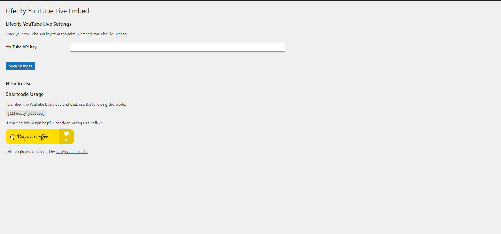

# Lifecity YouTube Live Embed

Automatically embeds YouTube Live video and chat on your website when live.

## Description

Lifecity YouTube Live Embed is a WordPress plugin that allows you to automatically embed your YouTube Live video and chat on your website when you are live. This plugin provides a user-friendly settings page where you can add your YouTube API key, and it uses a shortcode `[lifecity-youtube]` to embed the live video and chat on any post or page.

## Features

- Automatically embeds YouTube Live video and chat.
- User-friendly settings page to add your YouTube API key.
- Requires users to enter their name before they can join the live chat.
- Simple shortcode `[lifecity-youtube]` for embedding live video and chat.
- Accordion-style instructions for easy usage.
- Support for donations via Buy Me a Coffee.

## Installation

1. Upload the `lifecity-youtube` directory to the `/wp-content/plugins/` directory.
2. Activate the plugin through the 'Plugins' menu in WordPress.
3. Go to Settings -> Lifecity YouTube to enter your YouTube API key.
4. Use the `[lifecity-youtube]` shortcode in any post or page to embed the live video and chat.

## Usage

1. Add your YouTube API key in the plugin settings page.
2. Use the shortcode `[lifecity-youtube]` in any post or page where you want to display the live video and chat.

## Screenshots

1. **Settings Page**: Add your YouTube API key.
   
2. **Live Video**: Embed live video on your site.
   
3. **Live Chat**: Users must enter their name to join the chat.
   

## Frequently Asked Questions

**Q:** How do I get a YouTube API key?
**A:** You can obtain a YouTube API key from the [Google Developers Console](https://console.developers.google.com/).

**Q:** What if there is no live video currently available?
**A:** The shortcode will display a message saying "No live video is currently available."

## Changelog

### 1.0
- Initial release.

## Donations

If you find this plugin helpful, consider buying us a coffee!

## Credits

This plugin was developed by [Designolabs Studio](https://github.com/rizennews/).

## License

This plugin is licensed under the MIT License. See the LICENSE file for more information.
